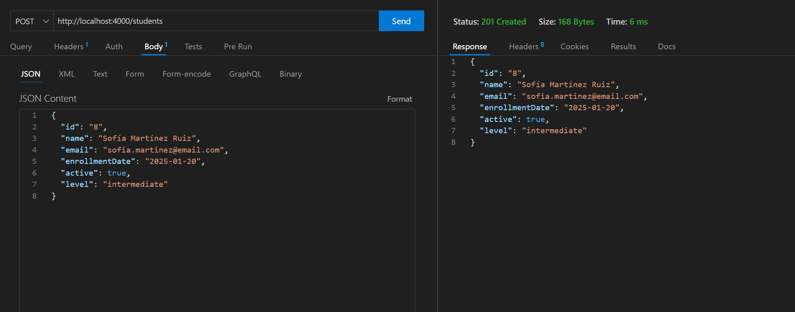
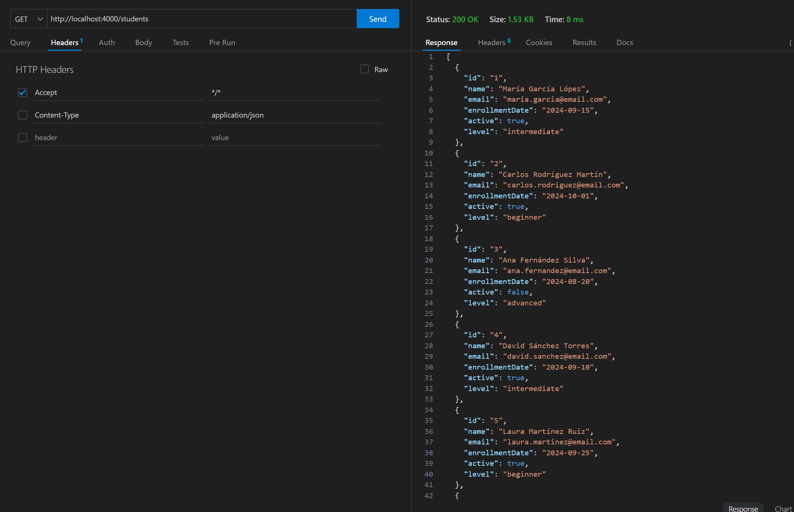
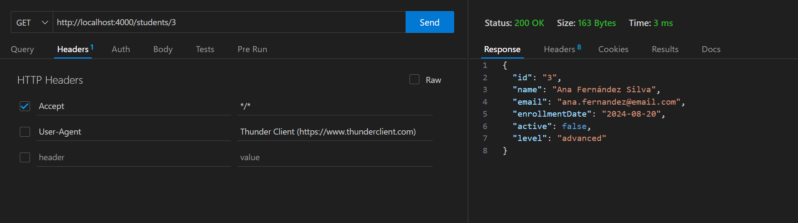
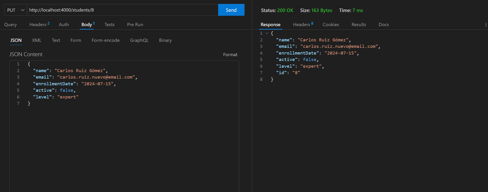
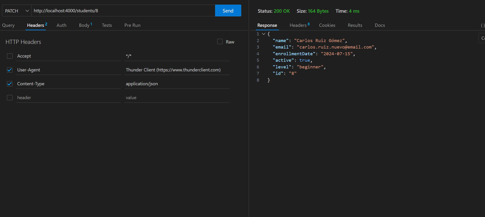
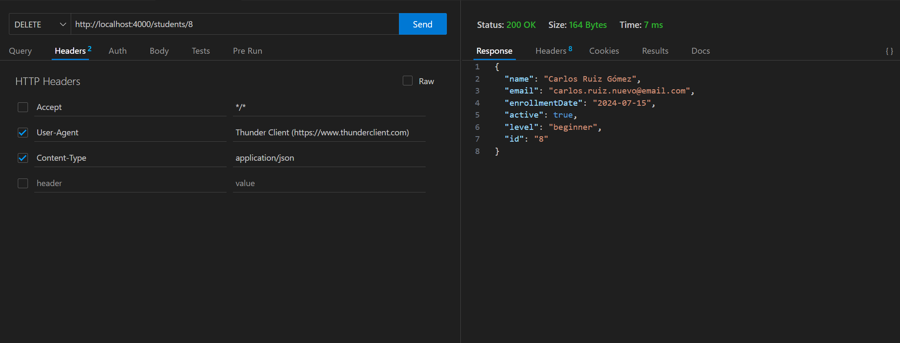

# manual-HTTP-Francisco-JJL-Ignacio-MT

## Documentación cURL

Este documento describe los comandos cURL generados para las operaciones CRUD sobre la colección `students` en el servidor JSON.

**BASE URL:** `http://localhost:4000`  
**ID de prueba para UPDATE/PATCH/DELETE/GET:** `3`  

---

## CREATE (POST)

**Descripción:** Crea un nuevo estudiante en la colección `/students`.  

**Método HTTP:** `POST`  
**Endpoint:** `/students`  
**Flags/Headers:**
- `-i` → Muestra headers de la respuesta.
- `-X POST` → Indica que es un POST.
- `-H 'Content-Type: application/json'` → Se envía un cuerpo en JSON.
- `-d '{...}'` → Cuerpo de la petición (datos del estudiante).  

**Comando ejecutado:**

```bash
curl -i -X POST \
    -H 'Content-Type: application/json' \
    -d '{"id":8,"name":"Juan José","email":"juan.jose@email.com","enrollmentDate":"2023-07-10","active":true,"level":"intermediate"}' \
    http://localhost:4000/students
```

HTTP/1.1 201 Created
Content-Type: application/json; charset=utf-8
Respuesta esperada:
{
  "id": 8,
  "name": "Juan José",
  "email": "juan.jose@email.com",
  "enrollmentDate": "2023-07-10",
  "active": true,
  "level": "intermediate"
}

Código de estado: 201 Created


## READ ALL (GET)

**Descripción:** Recupera todos los estudiantes de la colección `/students`.  
Esta función corresponde al comando cURL generado por `readAllStudents()`.

**Método HTTP:** `GET`  
**Endpoint:** `/students`  
**Flags/Headers:**
- `-i` → Muestra los headers de la respuesta.
- `-X GET` → Indica que es un GET.
- No se requiere `-H 'Content-Type'` ni `-d` ya que no se envía cuerpo de datos.

**Comando ejecutado:**

```bash
curl -i -X GET \
    http://localhost:4000/students
```
Respuesta esperada:
[
  {
    "id": 1,
    "name": "Ana Fernández Silva",
    "email": "ana.fernandez@email.com",
    "enrollmentDate": "2024-08-20",
    "active": false,
    "level": "advanced"
  },
  {
    "id": 8,
    "name": "Juan José",
    "email": "juan.jose@email.com",
    "enrollmentDate": "2023-07-10",
    "active": true,
    "level": "intermediate"
  }
]

Código de estado: 200 OK

## READ BY ID (GET)

**Descripción:** Recupera un estudiante específico por su ID de la colección `/students`.  
Esta función corresponde al comando cURL generado por `readStudentById()`.

**Método HTTP:** `GET`  
**Endpoint:** `/students/3`  
**Flags/Headers:**
- `-i` → Muestra headers de la respuesta.
- `-X GET` → Indica que es un GET.
- No se requiere `-H 'Content-Type'` ni `-d` ya que no se envía cuerpo de datos.

**Comando ejecutado:**

```bash
curl -i -X GET \
    http://localhost:4000/students/3
```
Respuesta esperada:
{
  "id": 3,
  "name": "Francisco José",
  "email": "fran.jose@email.com",
  "enrollmentDate": "2024-07-10",
  "active": true,
  "level": "beginner"
}

Código de estado: 200 OK

## UPDATE FULL (PUT)

**Descripción:** Actualiza completamente los datos de un estudiante.  
Todos los campos existentes serán reemplazados por los proporcionados.  
Esta función corresponde al comando cURL generado por `updateStudent()`.

**Método HTTP:** `PUT`  
**Endpoint:** `/students/3`  
**Flags/Headers:**
- `-i` → Muestra headers de la respuesta.
- `-X PUT` → Método PUT.
- `-H 'Content-Type: application/json'` → Indica que se envía JSON.
- `-d '{...}'` → Datos completos del estudiante.

**Comando ejecutado:**

```bash
curl -i -X PUT \
-H 'Content-Type: application/json' \
-d '{
  "id": 3,
  "name": "Francisco José",
  "email": "fran.jose@email.com",
  "enrollmentDate": "2024-07-10",
  "active": true,
  "level": "beginner"
}' \
http://localhost:4000/students/3
```

Respuesta esperada:
{
  "id": 3,
  "name": "Francisco José",
  "email": "fran.jose@email.com",
  "enrollmentDate": "2024-07-10",
  "active": true,
  "level": "beginner"
}

Código de estado: 200 OK

## PATCH (Modificación parcial)

**Descripción:** Modifica solo ciertos campos de un estudiante existente.  
Solo se actualizarán los campos incluidos en el objeto enviado.  
Esta función corresponde al comando cURL generado por `patchStudent()`.

**Método HTTP:** `PATCH`  
**Endpoint:** `/students/3`  
**Flags/Headers:**
- `-i` → Muestra headers de la respuesta.
- `-X PATCH` → Método PATCH.
- `-H 'Content-Type: application/json'` → Indica que se envía JSON.
- `-d '{...}'` → Campos a actualizar.

**Comando ejecutado:**

```bash
curl -i -X PATCH \
-H 'Content-Type: application/json' \
-d '{
  "active": false,
  "level": "advanced"
}' \
http://localhost:4000/students/3
```

Respuesta esperada:
{
  "id": 3,
  "name": "Francisco José",
  "email": "fran.jose@email.com",
  "enrollmentDate": "2024-07-10",
  "active": false,
  "level": "advanced"
}

Código de estado: 200 OK

## DELETE

**Descripción:** Elimina un estudiante por su ID de la colección `/students`.  
Esta función corresponde al comando cURL generado por `deleteStudent()`.

**Método HTTP:** `DELETE`  
**Endpoint:** `/students/3`  
**Flags/Headers:**
- `-i` → Muestra headers de la respuesta.
- `-X DELETE` → Método DELETE.

**Comando ejecutado:**

```bash
curl -i -X DELETE \
http://localhost:4000/students/3
```
Respuesta esperada:
HTTP/1.1 200 OK

Código de estado: 200 OK


---

## Documentación Visual: Thunder Client

**Thunder Client** es una extensión de VS Code que funciona como un **cliente REST ligero**. Permite a los desarrolladores probar, depurar y documentar peticiones HTTP directamente dentro del editor, sin necesidad de usar herramientas externas. Su interfaz gráfica facilita la validación de la **anatomía completa** de las peticiones (métodos, *headers* y cuerpos) y la inspección de las respuestas de la API.

A continuación, se documentan las seis operaciones CRUD realizadas de forma gráfica sobre la colección `/students` (corriendo en `http://localhost:4000`).

***

**Inciso:** En las peticiones que solo leen datos de la BD solo he usado el header estándar `Accept: */*`. Para las peticiones que si modifican la BD he usado los headers `content-type: application/json` y `User-Agent:Thunder Client`. Lo aclaro puesto que en algunas capturas no se aprecian los headers.

### 5.1. CREATE (POST)

**Propósito:** Crear un nuevo recurso (estudiante) en la colección `/students`.
**Detalle de la Petición:** Se envía un cuerpo **JSON** con los datos del nuevo estudiante.
**Resultado:** La API responde con el código de estado **`201 Created`**, y el objeto devuelto incluye el nuevo `id` asignado.



---

### 5.2. READ - Todos (GET All)

**Propósito:** Obtener la lista completa de todos los recursos disponibles en la colección.
**Detalle de la Petición:** Petición GET al endpoint base `/students`. No requiere cuerpo de datos.
**Resultado:** La API responde con **`200 OK`** y devuelve un *array* JSON que contiene la lista completa de estudiantes.



---

### 5.3. READ - Por ID (GET by ID)

**Propósito:** Recuperar los datos de un único estudiante específico.
**Detalle de la Petición:** Se incluye el ID del estudiante deseado directamente en la URL, por ejemplo: `/students/3`.
**Resultado:** La API responde con **`200 OK`** y devuelve el objeto JSON de un solo estudiante.



---

### 5.4. UPDATE - Completo (PUT)

**Propósito:** Reemplazar **completamente** un recurso existente por los datos nuevos.
**Detalle de la Petición:** Se requiere el ID en la URL y se debe enviar el **objeto JSON completo** en el cuerpo.
**Resultado:** La API responde con **`200 OK`** y el objeto JSON devuelto confirma el reemplazo total del recurso.



---

### 5.5. UPDATE - Parcial (PATCH)

**Propósito:** Modificar **solo** uno o varios campos específicos de un recurso sin afectar el resto.
**Detalle de la Petición:** Se requiere el ID en la URL y se envía un cuerpo **JSON parcial** que contiene únicamente los campos que deben ser actualizados.
**Resultado:** La API responde con **`200 OK`**. El objeto JSON devuelto muestra solo los campos actualizados, manteniendo los demás intactos.



---

### 5.6. DELETE (DELETE)

**Propósito:** Eliminar de forma permanente un recurso específico.
**Detalle de la Petición:** Se requiere el ID del recurso a eliminar en la URL. No se envía cuerpo de datos.
**Resultado:** La API responde con **`200 OK`** y un cuerpo de respuesta **vacío**, confirmando la eliminación.



---

### ⚙️ Manual de Uso Rápido de Thunder Client

1.  **Abrir la Extensión:** Haz clic en el icono del **Rayo (⚡)** en la barra lateral de VS Code.
2.  **Nueva Petición:** Haz clic en **"New Request"** (Nueva Petición).
3.  **URL y Método:**
    * Ingresa la URL del *endpoint* (ej: `http://localhost:4000/students`).
    * Selecciona el **Método HTTP** (GET, POST, PUT, DELETE, etc.) en el desplegable.
4.  **Añadir Cuerpo (Body):** Para métodos que envían datos (POST, PUT, PATCH), ve a la pestaña **`Body`**.
    * Selecciona el formato **`JSON`** en el desplegable.
    * Escribe el objeto JSON que deseas enviar.
5.  **Headers Clave:** Cuando seleccionas JSON en el paso 4, Thunder Client añade automáticamente el *header* **`Content-Type: application/json`** al Request, lo cual es esencial para que el servidor entienda el formato de los datos que le estás enviando.
6.  **Enviar:** Haz clic en el botón **`Send`**.
7.  **Inspeccionar Respuesta:** La respuesta aparecerá abajo, mostrando el código de estado (`200 OK`, `201 Created`, etc.), los *headers* de respuesta y el cuerpo JSON devuelto.
8.  **Guardar Petición:** Usa el botón de **Guardar** para archivar la petición en tu colección o historial.

***